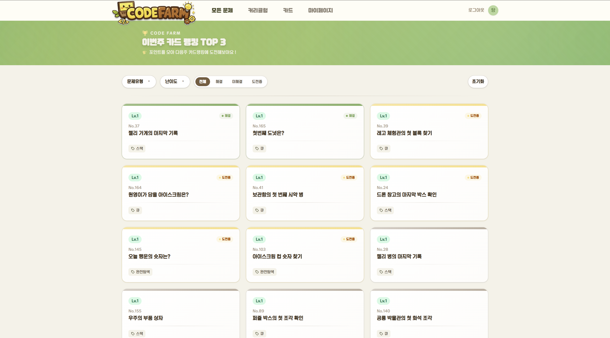
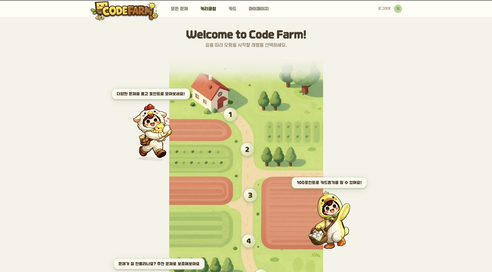
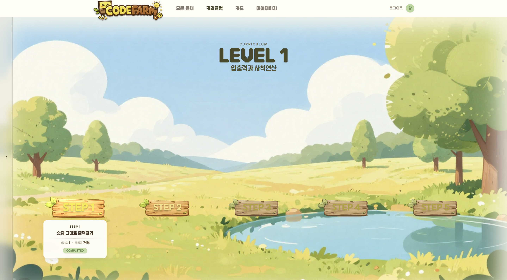
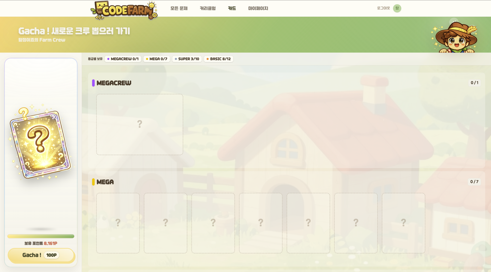
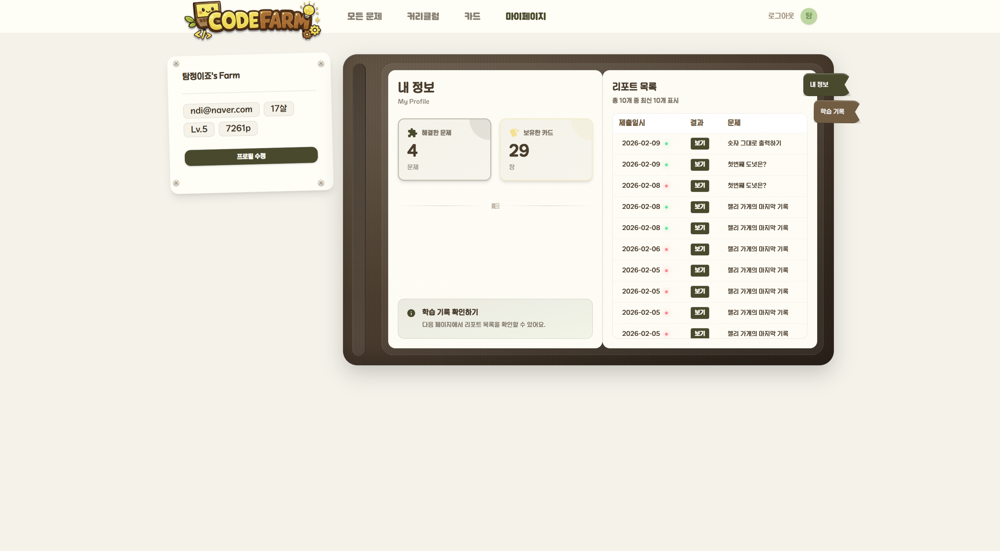
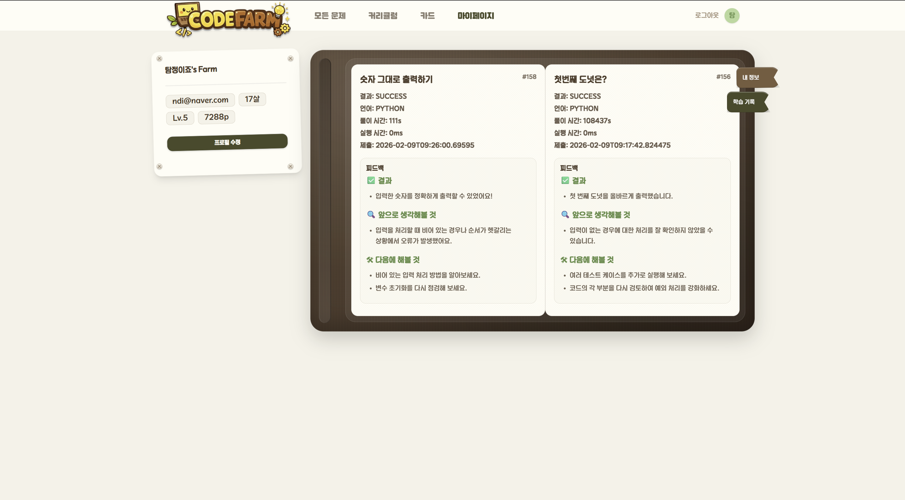
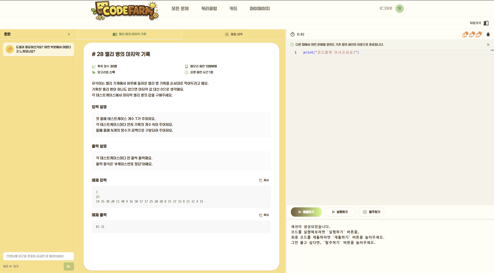
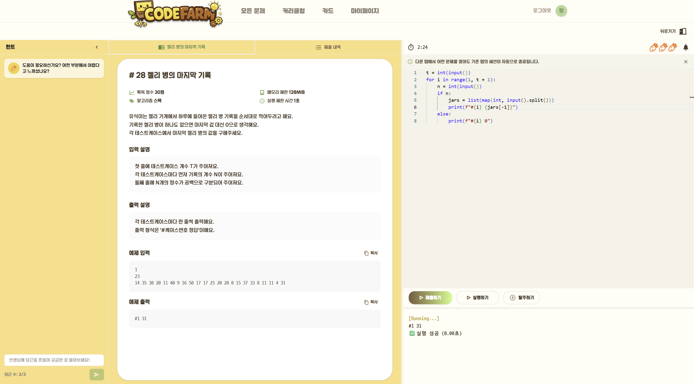
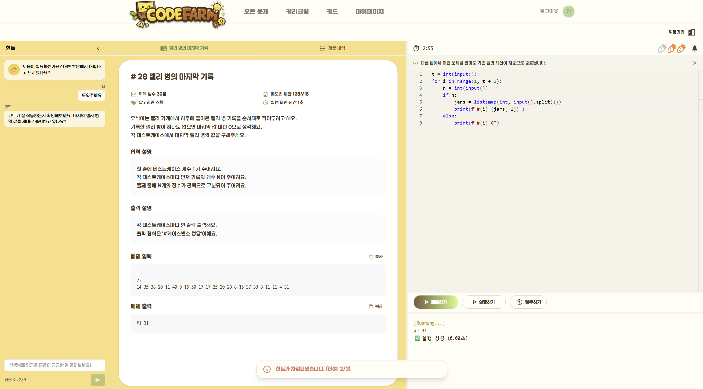
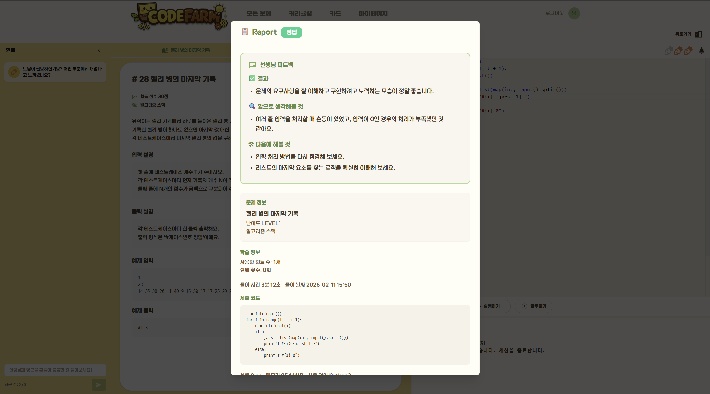

## Branch Naming Convention

본 프로젝트는 frontend와 backend를 하나의 레포지토리에서 관리한다.
따라서 feature 브랜치는 작업 범위(Frontend/Backend)와 도메인을 명확히 구분하여 네이밍한다.

### 1) 기본 규칙

* 브랜치명은 **소문자(kebab-case)** 를 사용한다.
* 단어 구분은 `-`를 사용한다. (예: `login-page`, `receipt-ocr`)
* 슬래시(`/`)는 계층 구분에만 사용한다.
* 브랜치명은 “무엇을” 하는지 식별 가능해야 한다. (추상명 금지: `test`, `tmp`, `new` 등)

### 2) feature 브랜치 규칙 (모노레포 대응)

---

## 🔎 목차

- [🙌 팀원 구성](#-팀원-구성)
- [🪄 기술 스택](#-기술-스택)
- [🛠️ 아키텍처](#-아키텍처)
- [📲 기능 구성](#-기능-구성)
- [📂 디렉터리 구조](#-디렉터리-구조)
- [📦 프로젝트 산출물](#-프로젝트-산출물)

---

## 🙌 팀원 구성

<table align="center">
  <tr>
    <td align="center">
      
      <br/>
      <b>박서연</b>
      <ul>
        <li>UI/UX 디자인 및 화면 설계</li>
        <li>서비스 비주얼 및 인터페이스 디자인</li>
      </ul>
    </td>
    <td align="center">
      
      <br/>
      <b>최연제</b>
      <ul>
        <li>프론트엔드 전반(Vue.js, Vite, Pinia) 구현</li>
        <li>IDE, 로드맵, 카드, 마이페이지, 힌트/피드백 UI 구현</li>
      </ul>
    </td>
    <td align="center">
      
      <br/>
      <b>김민경</b>
      <ul>
        <li>프로젝트 배포 일정 관리 및 정책 수립</li>
        <li>데이터 생성 및 검증</li>
        <li>Code llama 3B를 활용한 텍스트 생성 모델 파인튜닝</li>
        <li>AI 추론 서버(FastAPI) 설계 및 구현</li>
      </ul>
    </td>
  </tr>

  <tr>
    <td align="center">
      
      <br/>
      <b>남우성</b>
      <ul>
        <li>백엔드(Spring Boot) Session, Hint, User, Card, Curriculum 구현</li>
        <li>Execution/Feedback 서버 연동 및 API 설계</li>
      </ul>
    </td>
    <td align="center">
      
      <br/>
      <b>김형택</b>
      <ul>
        <li>DevOps 인프라(GitLab CI/CD, Docker, Nginx) 전담 구축</li>
        <li>배포 워크플로우 관리</li>
      </ul>
    </td>
    <td align="center">
      
      <br/>
      <b>정문기</b>
      <ul>
        <li>데이터 생성 및 검증</li>
        <li>Code llama 7B를 활용한 라벨링 모델 파인튜닝</li>
        <li>AI 추론 서버 파라미터 최적화</li>
      </ul>
    </td>
  </tr>
</table>

---

## 🪄 기술 스택

<div align="center">

### 🫡 Frontend


<table>
  <tr>
    <th>Category</th>
    <th>Specification</th>
  </tr>
  <tr>
    <td><b>Framework</b></td>
    <td>Vue 3.5.26</td>
  </tr>
  <tr>
    <td><b>Build Tool</b></td>
    <td>Vite 7.3.0</td>
  </tr>
  <tr>
    <td><b>State Management</b></td>
    <td>Pinia 3.0.4</td>
  </tr>
  <tr>
    <td><b>Router</b></td>
    <td>Vue Router 4.6.4</td>
  </tr>
  <tr>
    <td><b>CSS</b></td>
    <td>Tailwind CSS 4.1.18, DaisyUI 5.5.14, SASS</td>
  </tr>
  <tr>
    <td><b>Code Editor</b></td>
    <td>Monaco Editor 0.55.1</td>
  </tr>
    <td><b>Node.js</b></td>
    <td>^20.19.0 || >=22.12.0</td>
  </tr>
  <tr>
    <td><b>HTTP Client</b></td>
    <td>Axios 1.13.3</td>
  </tr>
  <tr>
    <td><b>Markdown / Sanitize</b></td>
    <td>marked 17.0.1, DOMPurify 3.2.7 (힌트·피드백 렌더링)</td>
  </tr>
  <tr>
    <td><b>Terminal (실행 결과)</b></td>
    <td>@xterm/xterm 6.0.0</td>
  </tr>
  <tr>
    <td><b>SSE</b></td>
    <td>eventsource-parser 3.0.6 (힌트 스트리밍)</td>
  </tr>
  <tr>
    <td><b>Lint / Format</b></td>
    <td>ESLint 9.39.2, Prettier 3.8.1</td>
  </tr>
  <tr>
    <td><b>Animation / Effect</b></td>
    <td>Vue Transition, Custom @keyframes, page-flip 2.0.7, canvas-confetti 1.9.4</td>
  </tr>
</table>

### 🤓 Backend


<table>
  <tr>
    <th>Category</th>
    <th>Specification</th>
  </tr>
  <tr>
    <td><b>Framework</b></td>
    <td>Spring Boot 3.5.9</td>
  </tr>
  <tr>
    <td><b>Java</b></td>
    <td>Java 17</td>
  </tr>
  <tr>
    <td><b>Build Tool</b></td>
    <td>Gradle 8.x</td>
  </tr>
  <tr>
    <td><b>Database</b></td>
    <td>PostgreSQL</td>
  </tr>
  <tr>
    <td><b>Cache</b></td>
    <td>Redis (Spring Data Redis)</td>
  </tr>
  <tr>
    <td><b>ORM</b></td>
    <td>Spring Data JPA, QueryDSL 5.0.0</td>
  </tr>
  <tr>
    <td><b>Auth</b></td>
    <td>Spring Security, JJWT 0.11.5</td>
  </tr>
  <tr>
    <td><b>HTTP Client</b></td>
    <td>Spring WebFlux (WebClient)</td>
  </tr>
</table>

### 🧐 AI / Data


<table>
  <tr>
    <th>Category</th>
    <th>Specification</th>
  </tr>
  <tr>
    <td><b>Framework</b></td>
    <td>FastAPI 0.128.0</td>
  </tr>
  <tr>
    <td><b>Runtime</b></td>
    <td>Uvicorn 0.40.0</td>
  </tr>
  <tr>
    <td><b>Deep Learning Env</b></td>
    <td>Python 3.11.9, PyTorch 2.7.0 (CUDA 12.8), Transformers 4.56.2</td>
  </tr>
  <tr>
    <td><b>Fine-tuning</b></td>
    <td>PEFT 0.18.1, BitsAndBytes 0.49.1, QLoRA</td>
  </tr>
  <tr>
    <td><b>Inference (힌트)</b></td>
    <td>Label Classifier(CodeLlama 7B), Text Generation(CodeLlama 3B)</td>
  </tr>
  <tr>
    <td><b>Feedback Server</b></td>
    <td>httpx, OpenAI API KEY(gpt-4o-mini)</td>
  </tr>
</table>

### 🥱 DevOps


<table>
  <tr>
    <th>Category</th>
    <th>Specification</th>
  </tr>
  <tr>
    <td><b>Instance Type</b></td>
    <td>AWS EC2 t2.xlarge</td>
  </tr>
  <tr>
    <td><b>CPU</b></td>
    <td>4 vCPUs</td>
  </tr>
  <tr>
    <td><b>RAM</b></td>
    <td>16 GB</td>
  </tr>
  <tr>
    <td><b>Storage</b></td>
    <td>SSD 320 GB</td>
  </tr>
  <tr>
    <td><b>Docker</b></td>
    <td>29.1.5</td>
  </tr>
  <tr>
    <td><b>Docker Compose</b></td>
    <td>v2.25.0</td>
  </tr>
  <tr>
    <td><b>CI/CD</b></td>
    <td>GitLab CI/CD</td>
  </tr>
  <tr>
    <td><b>CI Runner</b></td>
    <td>Self-hosted GitLab Runner (Docker executor)</td>
  </tr>
  <tr>
    <td><b>Nginx</b></td>
    <td>nginx/1.29.5</td>
  </tr>
  <tr>
    <td><b>K6</b></td>
    <td>v1.5.0</td>
  </tr>
  <tr>
    <td><b>Prometheus</b></td>
    <td>3.9.1</td>
  </tr>
  <tr>
    <td><b>Grafana</b></td>
    <td>12.3.2</td>
  </tr>
  <tr>
    <td><b>Webhook Handler</b></td>
    <td>Python 3.11-slim, FastAPI 0.128.0, Uvicorn[standard] 0.40.0</td>
  </tr>
</table>

### 😀 Collaboration


</div>

## 🛠️ 아키텍처


## 📲 기능 구성

<div align="center">

|             모든 문제              |                 커리큘럼                 |
| :--------------------------------: | :--------------------------------------: |
|  |  |

|              로드맵              |             카드             |
| :------------------------------: | :--------------------------: |
|  |  |

|           마이페이지(내정보)            |            마이페이지(학습기록)             |
| :-------------------------------------: | :-----------------------------------------: |
|  |  |

|           IDE            |               실행하기               |
| :----------------------: | :----------------------------------: |
|  |  |

|             힌트             |               피드백               |
| :--------------------------: | :--------------------------------: |
|  |  |

</div>

## 📂 디렉터리 구조

### GitLab Repository

<details>
  <summary>
    assets
  </summary>
  
  ```
  ./assets
  |-- architecture.png
  |-- cards.png
  |-- choi_yeonjae.jpg
  |-- curriculums.png
  |-- execution.png
  |-- feedback.png
  |-- hints.png
  |-- homepage.png
  |-- ide.png
  |-- jeong_mungi.jpg
  |-- kim_hyeongtaek.jpg
  |-- kim_minkyung.jpg
  |-- logo.png
  |-- mypage_info.png
  |-- mypage_record.png
  |-- nam_woosung.jpg
  |-- park_seoyeon.jpg
  |-- problems.png
  `-- roadmap.png
  ```

</details>
<details>
  <summary>
    backend
  </summary>

```
feature/frontend/<domain>/<task-name>
```

예시

* `feature/frontend/auth/login-ui`
* `feature/frontend/dashboard/settlement-widget`
* `feature/frontend/receipt/upload-flow`
* `feature/frontend/common/header-refactor`

#### Backend

```
feature/backend/<domain>/<task-name>
```

예시

* `feature/backend/auth/jwt-refresh`
* `feature/backend/ledger/export-endpoint`
* `feature/backend/receipt/ocr-parser`
* `feature/backend/common/exception-handler`

> `<domain>`: 기능 영역(예: auth, dashboard, receipt, ledger, common)
> `<task-name>`: 작업 내용(예: login-ui, export-endpoint)

### 3) infra / fix / hotfix 브랜치 규칙

#### infra

```
infra/<scope>/<task-name>
```

예시

* `infra/ci/branch-rules`
* `infra/deploy/dev-prod-scripts`
* `infra/nginx/reverse-proxy-conf`

#### fix (develop 기준 버그)

```
fix/<scope>/<issue-summary>
```

예시

* `fix/frontend/auth-login-validation`
* `fix/backend/ledger-null-pointer`
* `fix/common/env-parsing`

#### hotfix (main 기준 운영 긴급)

```
hotfix/<issue-summary>
```

예시

* `hotfix/payment-500-error`
* `hotfix/login-redirect-bug`

### 4) 병합 규칙(요약)

* `feature/*`, `infra/*`, `fix/*` → **develop** 로 Merge Request 병합
* `hotfix/*` → **main** 으로 병합(필요 시 develop에도 역병합)
* main 브랜치는 직접 push 금지(예외 규칙은 별도 정책 참조)

### 5) 권장 도메인 예시

* `auth` : 로그인/권한
* `receipt` : 영수증/업로드/OCR
* `ledger` : 장부/정산
* `dashboard` : 대시보드/지표
* `common` : 공통(UI 컴포넌트, 예외처리 등)
* `infra` : CI/CD, 서버, 배포, 설정

### 6) (선택) Issue 키 포함 규칙

이슈 트래킹(Jira 등)을 사용하는 경우 브랜치에 키를 포함할 수 있다.

Frontend 예시

* `feature/frontend/auth/login-ui-SSR-123`

Backend 예시

* `feature/backend/receipt/ocr-parser-SSR-208`


### Commit Message Convention

- 태그는 6개중 하나 사용(fix, feature, refactor, docs, chore, ci)
- 태그는 소문자
- 내용은 영어로 작성, 동사로 시작
- 예시
    - feat(backend): add controller advice
    - docs(infra): update commit message convention to README